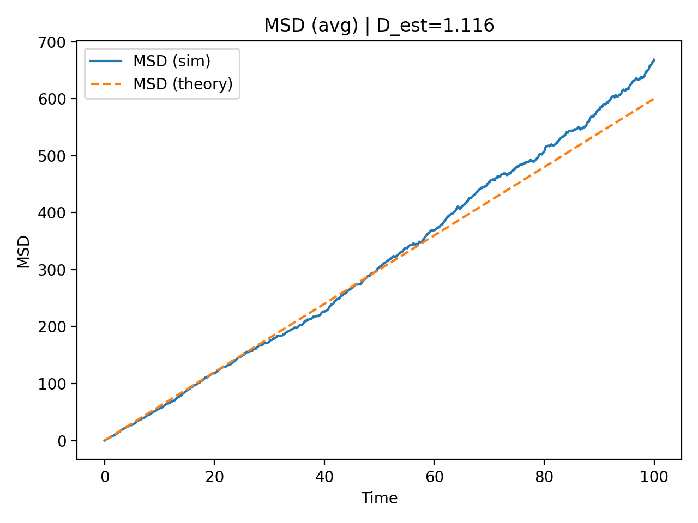

# 3D Brownian Motion Simulation (Drift–Diffusion Model)

## Introduction

This project implements a numerical simulation of **3D Brownian motion** using the drift–diffusion model. The objective is to reproduce and validate the theoretical prediction for the **Mean Squared Displacement (MSD)** and to estimate the diffusion coefficient from simulated trajectories.

In addition to the physical model, this project emphasizes:

- Clean and modular software design  
- Reproducibility through configuration files  
- Command-line execution  
- Automated testing  
- Clear separation between simulation, analysis, and visualization  

The repository is structured to satisfy academic requirements for clarity, reproducibility, and maintainability.

---

## Theoretical Background

### Brownian Motion

Brownian motion describes the random movement of microscopic particles suspended in a fluid due to collisions with surrounding molecules.

The stochastic dynamics can be modeled using the **Langevin equation**:

d𝐫/dt = 𝐯 + √(2D) ξ(t)

where:

- 𝐫(t) is the particle position in 3D  
- 𝐯 is a constant drift velocity  
- D is the diffusion coefficient  
- ξ(t) is Gaussian white noise  

---

### Discrete Numerical Model

For numerical simulation using time step `dt`, the equation becomes:

Δ𝐫 = 𝐯·dt + √(2D·dt) η

where η ~ 𝒩(0, I).

This discrete update rule is implemented in the simulation module.

---

### Mean Squared Displacement (MSD)

A fundamental observable in diffusion processes is the Mean Squared Displacement:

MSD(t) = ⟨ |𝐫(t) − 𝐫(0)|² ⟩

For pure diffusion in three dimensions:

MSD(t) = 6Dt

Thus, the diffusion coefficient can be estimated from the slope:

D = (1/6) d(MSD)/dt

The simulation numerically verifies this linear relationship.

---

## Project Structure

The repository follows the modern **`src/` layout** for Python projects.

```
configs/
    default.json

docs/
    msd_compare.png

src/particle_sim/
    simulate.py
    analysis.py
    viz.py
    io_utils.py
    cli.py

tests/
    test_simulate.py

pyproject.toml
README.md
.gitignore
```

### Module Description

**simulate.py**  
Implements the Brownian motion model using the discrete drift–diffusion equation.

**analysis.py**  
Computes Mean Squared Displacement (MSD), theoretical prediction (MSD = 6Dt), and estimates the diffusion coefficient.

**viz.py**  
Handles visualization only. It does not modify or preprocess data.

**io_utils.py**  
Manages configuration loading and CSV output saving.

**cli.py**  
Acts as the entry point of the program, connecting simulation, analysis, and visualization through a command-line interface.

**tests/**  
Contains unit tests implemented using `pytest` to ensure reproducibility and correctness.

---
## Requirements

This project requires:

- Python 3.10 or higher
- NumPy
- Matplotlib
- pytest (for running tests)

---
## Installation

Clone the repository:

```bash
git clone https://github.com/arman-nawaz/brownian-motion-simulator.git
cd brownian-motion-simulator
```

Create and activate a virtual environment:

```bash
python -m venv .venv
.venv\Scripts\activate
```

Install the package:

```bash
pip install -e .
```

For development and testing:

```bash
pip install -e ".[dev]"
```

---

## Running the Simulation

Run with default configuration:

```bash
python -m particle_sim.cli
```

Run without interactive plotting:

```bash
python -m particle_sim.cli --no-plot
```

Use custom configuration:

```bash
python -m particle_sim.cli --config configs/default.json
```

---

## Results

The simulation generates a `results/` directory containing:

- `trajectory_single.csv`
- `msd_single.csv`
- `msd_avg.csv`
- `msd_compare.png`
- `summary.txt`

### MSD Comparison

<p align="center">
  
</p>

The figure shows:

- Ensemble-averaged simulated MSD  
- Theoretical prediction MSD = 6Dt  
- Linear growth behavior  
- Diffusion coefficient estimated from slope  

The agreement between numerical results and theory validates the implementation.

---

## Testing

Unit tests are implemented using `pytest`.

Run tests:

```bash
pytest -q
```

The test suite verifies:

- Input validation and edge cases  
- Deterministic limits (D = 0, drift-only motion)  
- Correct trajectory shapes  
- MSD computation correctness  
- Diffusion estimator accuracy on ideal and simulated data 

---

## Reproducibility

Reproducibility is ensured by:

- Explicit random seed handling  
- Configuration-driven experiments  
- No hardcoded local file paths  
- Modular design  
- Installable package structure  

The project can be cloned and executed on any machine with Python ≥ 3.10.

---

## References

- A. Einstein (1905), *On the Motion of Small Particles Suspended in Liquids at Rest Required by the Molecular-Kinetic Theory of Heat*  
- M. Smoluchowski (1906), *Kinetic Theory of Brownian Motion*  
- C. W. Gardiner, *Stochastic Methods*  
- H. Risken, *The Fokker–Planck Equation*